# Tracee 核心流程图集合

本文档包含 Tracee 学习过程中最重要的流程图，使用 Mermaid 格式绘制。

---

## 1. Tracee 整体架构图


---

## 2. 事件完整生命周期流程


---

## 3. eBPF 事件捕获流程


---

## 4. 策略过滤器应用流程


---

## 5. 容器检测与丰富化流程


---

## 6. 签名引擎检测流程

```mermaid
graph LR
    A[事件到达] --> B[Signature Engine]

    B --> C{查找 eventSigs<br/>索引}

    C --> D[获取监听此事件<br/>的所有签名]

    D --> E{遍历签名列表}

    E --> F[签名 1: OnEvent]
    E --> G[签名 2: OnEvent]
    E --> H[签名 N: OnEvent]

    F --> I{检测到威胁?}
    G --> J{检测到威胁?}
    H --> K{检测到威胁?}

    I -->|是| L[Finding 1]
    J -->|是| M[Finding 2]
    K -->|是| N[Finding N]

    I -->|否| O[继续]
    J -->|否| O
    K -->|否| O

    L --> P[输出告警]
    M --> P
    N --> P

    O --> Q[处理下一个事件]

    style B fill:#ffe66d
    style P fill:#ff6b6b
```



---

## 7. Process Tree 维护流程


---

## 8. 事件排序器工作原理


---

## 9. CGroup 路径解析算法


---

## 10. 衍生事件生成流程


---

## 11. Bitmap 策略匹配优化

```mermaid
graph TB
    subgraph "策略位图表示"
        A[64个策略<br/>用 uint64 位图表示]
        A --> B[Bit 0 = Policy 0]
        A --> C[Bit 1 = Policy 1]
        A --> D[Bit 63 = Policy 63]
    end

    subgraph "事件匹配流程"
        E[Event: execve] --> F[初始化 matched = 0]

        F --> G{遍历策略 0-63}
        G --> H{Policy 0 匹配?}
        H -->|是| I[matched |= 1 << 0]
        H -->|否| J[继续]

        I --> K{Policy 1 匹配?}
        K -->|是| L[matched |= 1 << 1]
        K -->|否| J

        J --> M[...检查所有策略]
        L --> M

        M --> N{matched != 0?}
        N -->|是| O[发送给签名引擎]
        N -->|否| P[丢弃事件]
    end

    subgraph "性能优势"
        Q[单个 uint64 操作]
        R[CPU 缓存友好]
        S[位运算极快]
    end

    style A fill:#4ecdc4
    style O fill:#ffe66d
```

---

## 12. 容器运行时适配器架构


---

## 13. 自定义签名开发流程


---

## 14. Tracee 启动初始化流程


---

## 15. DNS 缓存工作流程


---

## 使用建议

### 如何查看这些图表？

1. **在 GitHub 上查看**：GitHub 原生支持 Mermaid 渲染
   ```bash
   git add docs/learning/diagrams.md
   git commit -m "docs: add mermaid diagrams"
   git push
   ```

2. **在 VSCode 中查看**：安装 Mermaid 插件
   - 插件名称：`Markdown Preview Mermaid Support`
   - 打开文件后使用预览功能（Ctrl+Shift+V）

3. **在线编辑器**：
   - [Mermaid Live Editor](https://mermaid.live/)
   - 复制图表代码进行编辑和导出

4. **生成图片**：使用 mermaid-cli
   ```bash
   npm install -g @mermaid-js/mermaid-cli
   mmdc -i diagrams.md -o diagrams.pdf
   ```

### 图表索引

- **图1-4**：架构和整体流程（适合初学者）
- **图5-7**：核心子系统详解（容器、签名、进程树）
- **图8-11**：算法和优化细节（排序、解析、衍生、位图）
- **图12-15**：高级特性（运行时适配、签名开发、初始化、DNS）

### 学习路径建议

```
第一周：图1 → 图2 → 图14
第二周：图3 → 图4 → 图8
第三周：图5 → 图9 → 图12
第四周：图6 → 图7 → 图13
```

---

**提示：** 这些图表对应学习路线图的 6 个阶段文档。建议结合具体代码和文档一起学习。
